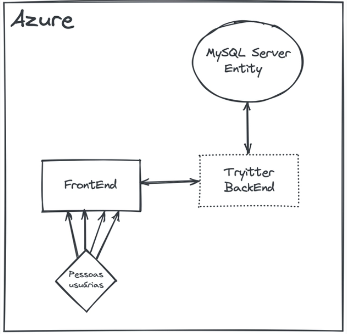

# Tryitter

<h2> Overview </h2>

O objetivo do projeto foi desenvolver uma API  que alimentasse uma rede social no modelo serviço de microblog, onde as pessoas estudantes podem se cadastrar com nome, e-mail, módulo atual que estão estudando na Trybe, status personalizado e senha para se autenticar. Também é possível alterar essa conta a qualquer momento, desde que a pessoa usuária esteja autenticada.

Além disso, uma pessoa estudante deve poder publicar posts em seu perfil, que poderá conter um texto com até 300 caracteres e arquivos de imagem, além de conseguir pesquisar outras contas por nome e optar por listar todos seus posts ou apenas o último.


<summary>
<strong>🔧 Instalação</strong>
</summary>

```bash
git clone git@github.com:thiagoguarino/trybe-tryitter-challenge.git
```
```bash
dotnet restore
```
```bash
dotnet run
```

Caso queira utilizar o docker, basta navegar até o nível do arquivo docker-compose e rodar o comando:

```bash
docker-compose up
```

<summary>
<strong>⚙️ Executando os testes</strong>
</summary>

```bash
dotnet test
```

<summary>
<strong>🛠️ Principais tecnologias utilizadas</strong>
</summary>

* [C#](https://learn.microsoft.com/pt-br/dotnet/csharp/)
* [.NET](https://learn.microsoft.com/pt-br/dotnet/)
* [AspNetCore]()
* [FluentAssertion](https://fluentassertions.com/introduction)
* [Xunit](https://learn.microsoft.com/pt-br/dotnet/core/testing/unit-testing-with-dotnet-test)
* [EntityFrameworkCore](https://learn.microsoft.com/pt-br/ef/)


<summary>
<strong>🖇️ Para contribuir com o projeto</strong>
</summary>

Para contribuir com XP-My-Investments, siga estas etapas:

1. Bifurque este repositório.
2. Crie um branch: `git checkout -b <nome_branch>`.
3. Faça suas alterações e confirme-as: `git commit -m '<mensagem_commit>'`
4. Envie para o branch original: `git push origin <nome_do_projeto> / <local>`
5. Crie a solicitação de pull.

Como alternativa, consulte a documentação do GitHub em [como criar uma solicitação pull](https://help.github.com/en/github/collaborating-with-issues-and-pull-requests/creating-a-pull-request).

</details>

<strong>📌 Versão</strong>


1.0

<h3> Demo </h3>


https://user-images.githubusercontent.com/86152767/207760959-14ad4602-ab47-4018-abfd-7201b633da53.mp4


